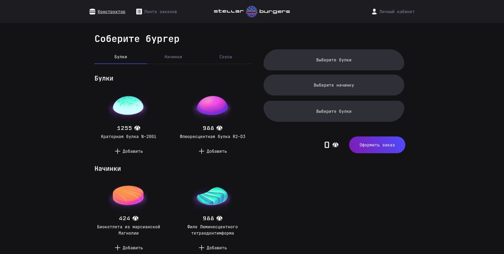
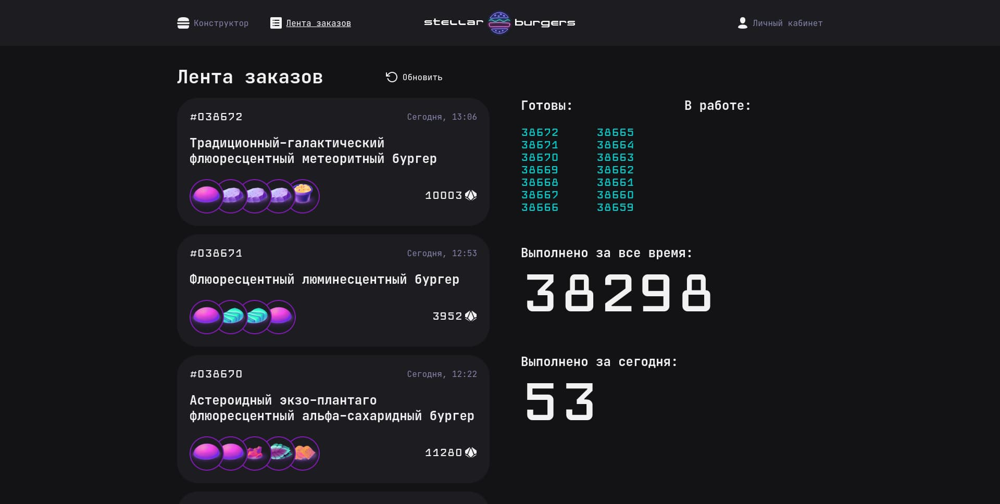
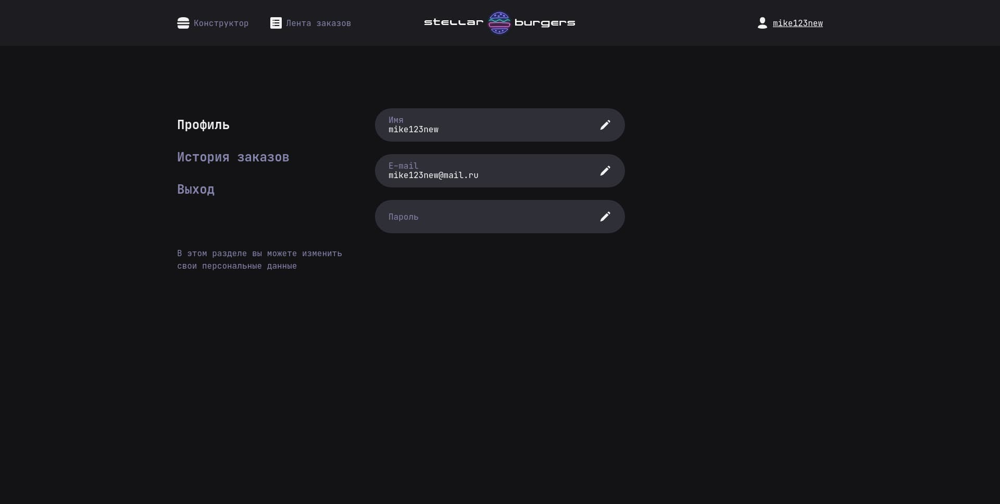

https://github.com/MikeBeloborodov/stellar-burger

# Проектная работа "Stellar Burger"

## Оглавление

- [Запуск](#запуск)
- [Сборка](#сборка)
- [Описание](#описание)
- [Скриншоты](#скриншоты)
- [Автор](#автор)
- [Благодарность](#благодарность)

## Запуск

Для установки и запуска проекта необходимо выполнить команды

```
npm install
npm run start
```

или

```
yarn
yarn start
```

## Сборка

```
npm run build
```

или

```
yarn build
```

## Описание

Сервис по заказу космических бургеров.

Стек: React, SCSS, TS, Webpack, Redux Toolkit

Структура проекта:

- src/ — исходные файлы проекта
- src/components/ — папка с React компонентами
- src/slices - папка со слайсами
- src/services/store - папка со стором
- src/hooks - папка с хуками

## Скриншоты





## Автор

- Github - [MikeBeloborodov](https://github.com/MikeBeloborodov)
- Frontend Mentor - [@MikeBeloborodov](https://www.frontendmentor.io/profile/MikeBeloborodov)

## Благодарность

Благодарю команду Яндекс Практикум за предоставление дизайна и уроков!
